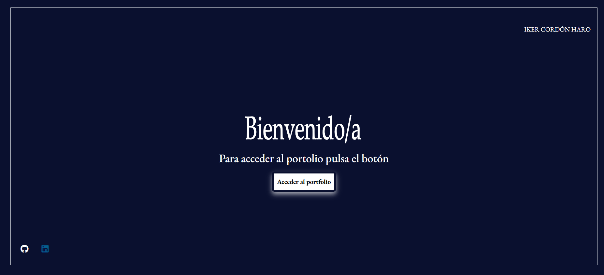

# 📚 Portafolio de proyectos

En esta aplicación podras ver los proyectos que he ido realizando a lo largo de tiempo, también un poco cuales son los conocimientos que he ido adquiriendo a lo largo del mismo.

## 🚀 Demo

[Enlace a la demo o página en vivo]

## 📸 Capturas de pantalla



## 🛠️ Tecnologías utilizadas

- Angular v17.0.8
- TypeScript
- HTML5/SCSS

## 📦 Instalación

### 1️⃣ Clonar la app**

```bash
git clone https://github.com/tu-usuario/tu-proyecto.git
```

### 2️⃣ Iniciar la app**

```bash
cd tu-proyecto
npm install
ng serve y navegar a `http://localhost:4200/` o también puedes poner directamente *ng serve -o*
```

## 📫 Contacto

Creado por **Iker Cordón Haro**

[LinkedIn](https://www.linkedin.com/in/iker-cordón-haro) | [GitHub](https://github.com/ikerCH-03)

¡Estaré encantado de conectar contigo!
